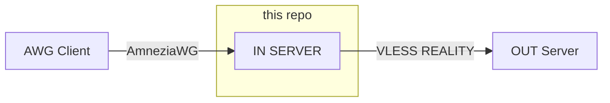
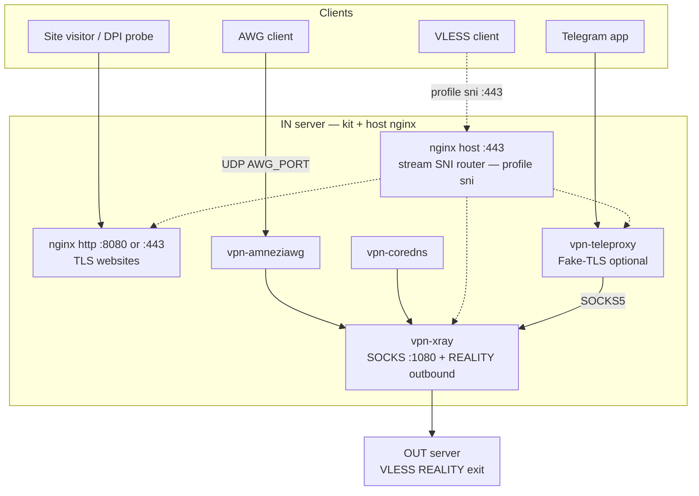

# Amnezia Reality Kit

AmneziaWG + Xray REALITY — IN server operator kit (checks & runbooks; egress to a separate OUT exit).





## Documentation

| | Link |
|---|------|
| Quick deploy | [docs/QUICKSTART.md](./docs/QUICKSTART.md) |
| All documentation | [docs/README.md](./docs/README.md) |

## Quick start (IN server)

```bash
git clone git@github.com-amnezia-kit:EvgBn/amnezia-reality-kit.git ~/vpn-test
cd ~/vpn-test

sudo ./scripts/setup/install-docker.sh    # if needed
sudo make deploy-host
make check-host

make create-data
make first-start
make awg-client-add NAME=phone
make check
```

## Client apps (AmneziaWG)

**Config files for the client:** `.data/clients_awg/<name>.conf` — one per `make awg-client-add NAME=<name>`. Transfer to the phone/PC and open in AmneziaWG.

| Platform | Download app |
|----------|--------------|
| Android | [Google Play](https://play.google.com/store/apps/details?id=org.amnezia.vpn) |
| iOS / macOS | [App Store](https://apps.apple.com/us/app/amneziawg/id6478942365) |
| Windows | [GitHub releases](https://github.com/amnezia-vpn/amneziawg-windows-client/releases) |
| Other | [amnezia.org/downloads](https://amnezia.org/downloads) |

## Contact

Telegram: [@amnezia_reality_kit](https://t.me/amnezia_reality_kit)

---

## Repo layout

```
├── Makefile                        # create-data, build, images, start, refresh-full, check, …
├── .env.example                    # mirror of config/examples/.env.example
├── ISSUES.md                       # known gaps
├── tests/                          # unit, integration, guards, fixtures
├── .data/                          # gitignored — live .env + build/
├── config/                         # templates, examples — see config/README.md
├── containers/                     # amneziawg, coredns, ipt2socks
├── scripts/                        # setup, preflight, deployment, maintenance
└── docs/
    ├── QUICKSTART.md               # operator funnel (deploy + daily)
    └── README.md                   # full index
```

## Credits

Inspired by [seb0ch/vpn](https://github.com/seb0ch/vpn).

Built on:

| Project | Role |
|---------|------|
| [amnezia-vpn/amneziawg-linux-kernel-module](https://github.com/amnezia-vpn/amneziawg-linux-kernel-module) | AmneziaWG kernel |
| [amnezia-vpn/amneziawg-tools](https://github.com/amnezia-vpn/amneziawg-tools) | AmneziaWG tools |
| [XTLS/Xray-core](https://github.com/XTLS/Xray-core) | Xray |
| [zfl9/ipt2socks](https://github.com/zfl9/ipt2socks) | Transparent TCP → SOCKS5 (IPv4+IPv6) |
| [coredns/coredns](https://github.com/coredns/coredns) | DNS server |
| [teleproxy/teleproxy](https://github.com/teleproxy/teleproxy) | Optional MTProxy (MTProto TCP); image `ghcr.io/teleproxy/teleproxy` — [MTPROXY.md](./docs/MTPROXY.md) |
| [Amnezia](https://amnezia.org/downloads) | Client apps |
| [Amnezia Docs](https://docs.amnezia.org) | Documentation |
