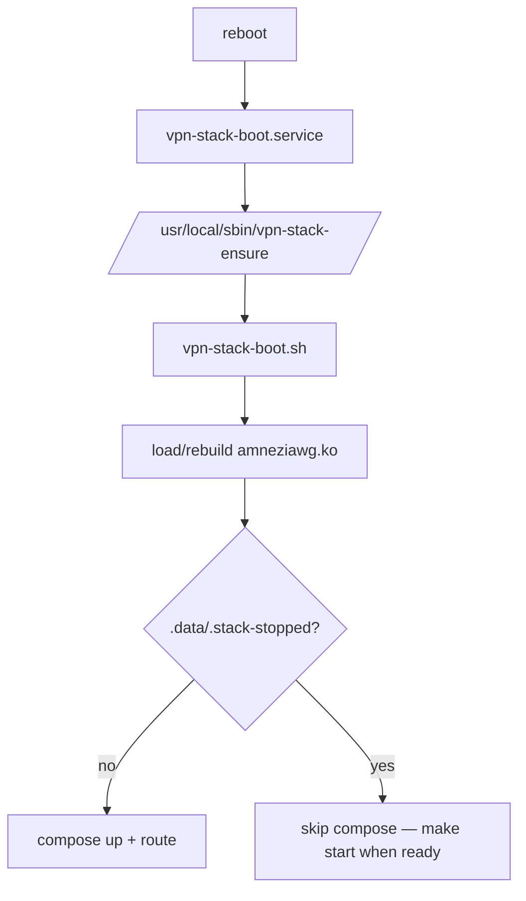

# VPN Server — Architecture

**Version:** 2.0 (container-based)
**Last updated:** 2026-09-05

**Shell:** `make ps` / `make logs` for stack. For `dc exec` / `dc logs` below, from repo root:

```bash
cd <REPO_ROOT>
dc() { docker compose -f .data/build/docker-compose.yml --env-file .data/.env "$@"; }
```

Full convention: [OPERATIONS.md § Convention](./OPERATIONS.md#convention-repo-root).

---

## Prerequisites

- **OS:** Ubuntu 24.04 LTS recommended (`make check` WARNs below 24.04). Debian 12+ / kernel 5.15+.
- **Docker:** 24.0+ with Compose V2
- **Kernel modules:** `wireguard`, `ip6table_nat`, `xt_REDIRECT`
- **Network:** Public IPv4 + IPv6 addresses
- **Ports:** UDP `AWG_PORT` on IN; optional VLESS TCP (`ENABLE_XRAY_INBOUND`, `XRAY_INBOUND_PORT`); OUT exit `OUT_REALITY_PORT` (default 443 on **OUT** host). See [PORT-443.md](./PORT-443.md).

**Verify kernel support:**

```bash
# Check WireGuard
lsmod | grep wireguard || modprobe wireguard

# Check IPv6 NAT
modprobe ip6table_nat
lsmod | grep ip6table_nat
```

---

## Terminology

| Term | Meaning |
|------|---------|
| **IN** / `<IN_SERVER>` | Entry server (this stack). Ingress tuple `IN_INGRESS` in `.env` (e.g. `'4; 203.0.113.1'`) |
| **OUT** | Exit server. REALITY target from `OUT_EXIT` (e.g. `'6; 2a10:…'`) |

### Three blocks

```
                                      this repo                      ║
                                  ◄───────────────►                  ║
                                                                     ║
┌───────────────┐    AmneziaWG    ┌───────────────┐  VLESS REALITY   ║   ┌───────────────┐
│  AWG Client   │ ───────────────►│  IN SERVER    │─────────────────►║──►│  OUT Server   │
└───────────────┘                 └───────────────┘                  ║   └───────────────┘
```

Everything inside **IN SERVER** is deployed from this repository. OUT is configured via `OUT_*` in `.data/.env`; it is not part of this compose stack.

---

## Design Principles

1. **Zero Trust**: All client traffic forced through REALITY tunnel to OUT server
2. **DNS Leak Protection**: No direct DNS queries escape past `<IN_SERVER>` to local ISP (score: 9.4/10)
3. **Transparent Proxy**: iptables + ipt2socks, no client-side SOCKS config
4. **Container architecture**: ipt2socks shares netns with AWG/CoreDNS (no routing complexity)
5. **IPv6-First Exit**: REALITY listens only on OUT IPv6, Docker network must have `enable_ipv6`

---

## Component Overview

| Component | Image | IPv4 | IPv6 (docker) | Role | Ports |
|-----------|-------|------|---------------|------|-------|
| **amneziawg** | `amneziawg:${AMNEZIAWG_RELEASE}` | `${AMNEZIAWG_IP}` | `${AMNEZIAWG_IPV6}` | AWG server + ipt2socks + iptables | `0.0.0.0:<AWG_PORT>`→51820/udp |
| **coredns** | `${COREDNS_IMAGE}` (default `coredns:1.11.1`) | `${COREDNS_IP}` | **`${COREDNS_IPV6}`** (pinned) | DNS + ipt2socks for DoT | Docker-only :53 |
| **xray** | `${XRAY_IMAGE}` (default `teddysun/xray:26.6.27`) | `${XRAY_IP}` | `${XRAY_IPV6}` | SOCKS :1080 (Docker); optional VLESS inbound; REALITY **outbound** to OUT | `127.0.0.1:1080`; public TCP only if `ENABLE_XRAY_INBOUND=1` (`XRAY_INBOUND_PORT`, default 443) |
| **teleproxy** | `ghcr.io/teleproxy/teleproxy:${TELEPROXY_VERSION}` | `${TELEPROXY_IP}` | `${TELEPROXY_IPV6}` | Optional MTProto (Fake-TLS); egress via SOCKS → OUT | Host TCP only if `ENABLE_MTPROXY=1` (default `MTPROXY_HOST_PORT=8444`) — see [MTPROXY.md](./MTPROXY.md) |

### Host port policy (IN server)

| Traffic | Host port | Controlled by |
|---------|-----------|-----------------|
| AmneziaWG clients | UDP `AWG_PORT` | always (this repo) |
| Direct VLESS clients | TCP `XRAY_INBOUND_PORT` | `ENABLE_XRAY_INBOUND=1` in `.env` |
| Website / other TLS | TCP `:443` | **outside repo** (nginx/caddy) |
| MTProxy (optional) | TCP `MTPROXY_HOST_PORT` or `:443` via nginx SNI | `ENABLE_MTPROXY=1`; see [MTPROXY.md](./MTPROXY.md) |
| IN → OUT exit | outbound to address from `OUT_EXIT`:`OUT_REALITY_PORT` | `.env`; not a listen on IN |

**MTProxy maturity:** `MTPROXY_MODE=standalone` (~8.8) publishes TG on `:8444`; `MTPROXY_MODE=sni` (9+) uses nginx stream on host `:443` with loopback backends — kit does not install nginx.

Default `ENABLE_XRAY_INBOUND=1` preserves classic VLESS-on-443 installs. Set `ENABLE_XRAY_INBOUND=0` to free host :443 for a co-located website.

**⚠️ IPv6 addressing (three scopes):**

| Scope | Variable | Type | Example | Notes |
|-------|----------|------|---------|-------|
| **OUT exit** | `OUT_EXIT` (family `6`) | **GUA** (public) | `2606:…` | REALITY target on remote OUT server |
| **AWG tunnel** | `AWG_TUNNEL_IPV6` | **ULA** (RFC 4193) | `fd86:ea04:1115::1/64` | Client tunnel addresses; not routed on public Internet |
| **Docker bridge** | `DOCKER_NETWORK_SUBNET_IPV6` | **ULA** (RFC 4193) | `fd87:172:20::/64` | Inter-container on IN host only |

**Never use `2001:db8::/32` in production** — RFC 3849 documentation prefix. Old stacks used `2001:db8:1::/64` for Docker; migrate to ULA in `.env` and **`make refresh-full`**.

**Docker IPv6 note:** All container IPv6 addresses are **pinned** in `docker-compose.yml` (`COREDNS_IPV6`, `AMNEZIAWG_IPV6`, `XRAY_IPV6`) — same pattern as IPv4. Gateway is `${DOCKER_NETWORK_GATEWAY_IPV6}` (::1 in the ULA subnet). Verify with:

```bash
dc exec xray ip -6 addr show eth0 | grep inet6
dc exec coredns ip -6 addr show eth0 | grep inet6
```

### AWG Tunnel (awg0)

- **Config:** `.data/build/awg0.conf` (from `config/templates/awg0.conf.tmpl` + `make build`)
- **IPv4:** 10.8.0.1/24 (server), clients 10.8.0.0/24
- **IPv6:** fd86:ea04:1115::1/64 (ULA), clients fd86:ea04:1115::/64
- **MTU:** 1420
- **Protocol:** AmneziaWG (obfuscated WireGuard)
- **Endpoint:** `<ingress-host>:<AWG_PORT>` (UDP; host = IPv4 from `IN_INGRESS`, see `.env`)

### Docker Network (vpn)

```yaml
networks:
  vpn:
    name: vpn
    driver: bridge
    enable_ipv6: true  # ⚠️ CRITICAL for REALITY exit
    ipam:
      config:
        - subnet: ${DOCKER_NETWORK_SUBNET_IPV4}   # default 10.200.97.0/24 — SSOT in .env
          gateway: ${DOCKER_NETWORK_GATEWAY_IPV4} # derived .1 on make build
        - subnet: ${DOCKER_NETWORK_SUBNET_IPV6}   # ULA — fd87:172:20::/64
          gateway: ${DOCKER_NETWORK_GATEWAY_IPV6}
```

Container IPv4/IPv6 are pinned in build compose: `COREDNS_IP` (.2), `AMNEZIAWG_IP` (.3), `XRAY_IP` (.4), `TELEPROXY_IP` (.5) — all derived from `DOCKER_NETWORK_SUBNET_*` unless overridden in `.env`.

**Bridge interface:** `br-XXXX` (dynamic ID, e.g., `br-4d42fb03b086`)

**Critical:** OUT server listens **only on IPv6** (address from `OUT_EXIT`, port `OUT_REALITY_PORT`, default 443). Without `enable_ipv6: true`, xray cannot establish REALITY tunnel → all traffic fails.

---

## Traffic Flows

### Exit path overview (TCP + UDP → xray → OUT)

Default Docker IPs (`${AMNEZIAWG_IP}` / `${XRAY_IP}`); SOCKS port `${SOCKS_PORT}` (1080).

```
Phone (AWG client)
    │
    ▼
amneziawg (${AMNEZIAWG_IP})
    │
    ├─ TCP: ipt2socks ──SOCKS5 TCP──► ${XRAY_IP}:1080
    │
    └─ UDP: udp-relay ──SOCKS5 UDP associate──► 172.20.0.4:1080
                                              │
                                              ▼
                                         vpn-xray (xray)
                                              │
                                              ▼ REALITY outbound
                                         OUT server
```

DNS (:53) branches to **coredns** before xray; details below. After config/image changes use **`make refresh-full`** — partial container restart desyncs the SOCKS UDP associate (Telegram voice `inject=0`).

---

### 1. DNS (UDP/TCP :53) — IPv4

```
┌─────────────┐
│ AWG Client  │ dig @10.8.0.1 google.com
│ 10.8.0.7    │
└──────┬──────┘
       │ awg0
       ↓
┌──────────────────────────────────────────────────────────────┐
│ amneziawg (172.20.0.3)                                   │
│ iptables PREROUTING:                                         │
│   DNAT udp :53 → 172.20.0.2:53 (CoreDNS)          [rule #1] │
└──────────────────────┬───────────────────────────────────────┘
                       │
                       ↓
┌──────────────────────────────────────────────────────────────┐
│ coredns (172.20.0.2)                                     │
│ CoreDNS: forward tls://1.1.1.1:853                           │
│ iptables OUTPUT:                                             │
│   REDIRECT tcp :853 → 127.0.0.1:12347 (ipt2socks)  [rule #1] │
│ ipt2socks :12347 → SOCKS 172.20.0.4:1080                      │
└──────────────────────┬───────────────────────────────────────┘
                       │
                       ↓
┌──────────────────────────────────────────────────────────────┐
│ xray (172.20.0.4)                                            │
│ SOCKS :1080 [socks-in → exit]                                │
│ REALITY outbound → <OUT_EXIT address>:443                      │
└──────────────────────┬───────────────────────────────────────┘
                       │ IPv6 over Docker network
                       ↓
                ┌──────────────┐
                │ OUT Server   │ (egress IPv4, see OUT_EXPECTED_EGRESS)
                │ Cloudflare   │ → 1.1.1.1:853
                └──────────────┘
```

**Key points:**

- Client sees response from 10.8.0.1:53 (DNAT reverse NAT)
- CoreDNS DoT queries **never** go direct to 1.1.1.1 from `<IN_SERVER>`
- All DoT traffic exits via REALITY tunnel (stealth)

---

### 2. HTTP/HTTPS (TCP) — IPv4

```
┌─────────────┐
│ AWG Client  │ curl https://google.com
│ 10.8.0.7    │
└──────┬──────┘
       │ awg0
       ↓
┌──────────────────────────────────────────────────────────────┐
│ amneziawg (172.20.0.3)                                   │
│ iptables PREROUTING:                                         │
│   REDIRECT tcp dport !53 → :12345                 [rule #3]  │
│ ipt2socks :12345 (SO_ORIGINAL_DST)                            │
│   → SOCKS 172.20.0.4:1080                                    │
└──────────────────────┬───────────────────────────────────────┘
                       │
                       ↓
┌──────────────────────────────────────────────────────────────┐
│ xray (172.20.0.4)                                            │
│ SOCKS :1080 auth: vpn-user / <SOCKS_PASSWORD>                │
│ [socks-in → exit] REALITY → OUT                              │
└──────────────────────┬───────────────────────────────────────┘
                       │
                       ↓
                ┌──────────────┐
                │ OUT Server   │ (public egress IPv4)
                │ Internet     │ → google.com
                └──────────────┘
```

**Exit IP seen by google.com:** matches `OUT_EXPECTED_EGRESS` (check-only hint in `.env`; set to real curl IP after deploy)

---

## iptables Rules (amneziawg)

Rules are defined in `.data/build/awg0.conf` PostUp/PostDown (template: `config/templates/awg0.conf.tmpl`) and applied on `awg-quick up awg0`.

### IPv4 PREROUTING (NAT)

| # | Rule | Purpose | Packets/hour |
|---|------|---------|--------------|
| 1 | DNAT udp :53 → 172.20.0.2:53 | DNS to CoreDNS | ~200 |
| 2 | DNAT tcp :53 → 172.20.0.2:53 | DNS TCP fallback | ~0 |
| 3 | REDIRECT tcp !:53 → :12345 | HTTP/HTTPS to ipt2socks | ~2000 |

### IPv4 mangle PREROUTING (UDP exit)

| # | Rule | Purpose |
|---|------|---------|
| 1 | NFQUEUE udp !:53,:784,:8853 !LOCAL → queue `${AWG_NFQUEUE_NUM}` | VoIP/STUN/QUIC → **udp-relay** (userspace) → SOCKS → OUT |

No TPROXY or policy routing — packets are handled in userspace via `libnetfilter_queue`.

### IPv4 POSTROUTING (NAT)

| # | Rule | Purpose | Packets/hour |
|---|------|---------|--------------|
| 1 | MASQUERADE 10.8.0.0/24 | Outbound source NAT | ~5000 |

### IPv4 FORWARD (Filter)

| # | Rule | Purpose | Packets/hour |
|---|------|---------|--------------|
| 1 | DROP awg0 → awg0 | Prevent peer-to-peer | 0 |
| 2-3 | ACCEPT → 172.20.0.2:53 (udp/tcp) | DNS to CoreDNS | ~200 |
| 4-8 | DROP RFC1918 ranges | Prevent docker/host access | ~0 |
| 9-10 | DROP DoQ :784,:8853 | Block DNS-over-QUIC | ~0 |
| 11 | DROP udp !:53 (anti-leak) | Block RF MASQUERADE for exit UDP | ~0 |
| 12 | ACCEPT -i awg0 | Allow TCP/DNS forward | ~3000 |
| 13 | ACCEPT ESTABLISHED -o awg0 | Allow return traffic | ~2500 |

**RFC1918 ranges blocked:**

- 10.0.0.0/8
- 172.16.0.0/12
- 192.168.0.0/16
- 169.254.0.0/16
- 100.64.0.0/10

**Rationale:** Prevent clients from accessing host services, Docker internal networks, and other docker networks.

---

### ip6tables (IPv6)

Analogous to IPv4, but:

- DNAT :53 → `[COREDNS_IPV6]:53` (pinned in compose; rendered into `awg0.conf` via `${COREDNS_IPV6}`)
- REDIRECT tcp !:53 → :12346 (ipt2socks v6 on `${AWG_TUNNEL_GATEWAY_IPV6}`)
- MASQUERADE fd86:ea04:1115::/64
- FORWARD: DROP udp !:53 before general ACCEPT (anti-leak; **no IPv6 UDP relay** — exit UDP is IPv4 NFQUEUE only)

---

## ipt2socks + udp-relay (transparent proxy)

Built shell scripts under `.data/build/` (from `config/templates/ipt2socks-*.tmpl`):

| Container | Scripts | Listen / capture |
|-----|---------|------------------|
| **amneziawg** | `ipt2socks-amneziawg-v4.sh`, `ipt2socks-amneziawg-v6.sh`, `udp-relay-run.sh` | TCP REDIRECT `${AWG_IPT2SOCKS_PORT}` / `${AWG_IPT2SOCKS_PORT_IPV6}`; UDP NFQUEUE → **udp-relay** binary |
| **coredns** | `ipt2socks-coredns.sh` | `${COREDNS_IPT2SOCKS_PORT}` (DoT :853 upstream) |

Traffic paths:

- **TCP:** `iptables`/`ip6tables` REDIRECT → **ipt2socks -T** → Xray SOCKS `172.20.0.4:1080` → REALITY OUT.
- **UDP (≠:53, IPv4):** `iptables` NFQUEUE → **udp-relay** (Go, built into amneziawg image) → same SOCKS path → REALITY OUT.
- **UDP (≠:53, IPv6):** blocked at FORWARD (no relay yet).

**SOCKS UDP associate (voice):** udp-relay in **amneziawg** and **xray** share one logical SOCKS UDP associate on `172.20.0.4:1080`. Return VoIP packets are injected back through that associate — if only one container is recreated or restarted, outbound UDP can work while **`relay first inject=0`** and Telegram stays on **Connecting…**. udp-relay **reconnects** the associate when xray closes the control TCP (`connIdle`); see [IPT2SOCKS.md § udp-relay](./IPT2SOCKS.md#udp-relay-go). After config, image, or `.env` changes, redeploy the **full stack** with **`make refresh-full`** (not `--force-recreate` / `docker restart` on a single container). Smoke test and troubleshooting: **[VOICE.md](./VOICE.md)**.

Voice smoke: `make voice-gate WATCH=30` (gate) or `make voice-smoke-report` (full logs) — see [VOICE.md](./VOICE.md).

**Tuning (`.env`):** `IPT2SOCKS_THREADS`, `IPT2SOCKS_NOFILE_LIMIT`, `IPT2SOCKS_UDP_TIMEOUT`; compose `ulimits.nofile` (8192/16384). Under heavy parallel HTTPS, watch FD usage via `pgrep -x ipt2socks` and `/proc/<pid>/fd`.

Full reference: **[IPT2SOCKS.md](./IPT2SOCKS.md)**.

---

## Xray Configuration

**Config:** `.data/build/config.json` (from `config/templates/config.json.tmpl` + `make build`)

### Inbound: SOCKS5 (:1080)

```json
{
  "listen": "::",
  "port": 1080,
  "protocol": "socks",
  "tag": "socks-in",
  "settings": {
    "auth": "password",
    "accounts": [
      {
        "user": "vpn-user",
        "pass": "<SOCKS_PASSWORD>"
      }
    ],
    "udp": true
  }
}
```

**Published:** `127.0.0.1:1080` (host access for testing)

---

### Inbound: VLESS REALITY (optional, `ENABLE_XRAY_INBOUND=1`)

**Optional.** Rendered only when `ENABLE_XRAY_INBOUND=1` in `.data/.env`. When `0`, `apply-xray-inbound.py` removes this inbound from `config.json` and host `:443` is free for a website — see [PORT-443.md](./PORT-443.md). AWG bridge and IN→OUT exit are unchanged.

```json
{
  "port": ${XRAY_INBOUND_PORT},
  "listen": "0.0.0.0",
  "protocol": "vless",
  "settings": {
    "clients": [...],
    "decryption": "none"
  },
  "streamSettings": {
    "network": "tcp",
    "security": "none",
    "realitySettings": {
      "dest": "<REALITY_DEST>",
      "serverNames": ["<REALITY_INBOUND_SERVER_NAME>"],
      "privateKey": "<REALITY_PRIVATE_KEY>",
      "shortIds": ["<REALITY_SHORT_ID>"]
    }
  }
}
```

**Note:** `security: "none"` on inbound is a known config quirk. Doesn't affect SOCKS→exit path. Relevant only when `ENABLE_XRAY_INBOUND=1` and direct VLESS clients connect to ingress host (`IN_INGRESS`) on `XRAY_INBOUND_PORT`.

---

### Outbound: REALITY to OUT

```json
{
  "tag": "exit",
  "protocol": "vless",
  "settings": {
    "vnext": [
      {
        "address": "<address from OUT_EXIT>",
        "port": ${OUT_REALITY_PORT},
        "users": [
          {
            "id": "<OUT_VLESS_UUID>",
            "encryption": "none",
            "flow": "xtls-rprx-vision"
          }
        ]
      }
    ],
    "udp": true,
    "domainStrategy": "UseIPv6"
  },
  "streamSettings": {
    "network": "tcp",
    "security": "reality",
    "realitySettings": {
      "serverName": "<OUT_REALITY_SERVER_NAME>",
      "publicKey": "<OUT_REALITY_PUBLIC_KEY>",
      "shortId": "<OUT_REALITY_SHORT_ID>",
      "fingerprint": "chrome"
    }
  }
}
```

**Critical:** OUT listens **only on IPv6**. Docker network must have `enable_ipv6: true` or xray cannot connect.

**`.env` keys (rendered into `config.json`):**

| Key | `config.json` field | Default (bootstrap) |
|-----|---------------------|---------------------|
| `REALITY_DEST` | inbound `realitySettings.dest` | `cloudflare.com:443` |
| `REALITY_INBOUND_SERVER_NAME` | inbound `realitySettings.serverNames[0]` | `apple.com` |
| `OUT_REALITY_SERVER_NAME` | outbound `realitySettings.serverName` | `dl.google.com` |

Change mask/SNI in `.data/.env`, then **`make refresh-full`**.

**Routing:** `domainStrategy: UseIPv6` ensures DNS resolution prefers AAAA records.

---

## Healthchecks

| Container | Interval | Timeout | Test |
|-----------|----------|---------|------|
| amneziawg | 30s | 10s | `/healthcheck.sh` (awg0 UP + 2× ipt2socks tcp + udp-relay + REDIRECT/NFQUEUE rules) |
| coredns | 30s | 5s | `/healthcheck.sh` (ipt2socks + coredns + `dig @127.0.0.1`) |
| xray | 30s | 5s | `pgrep xray` |

**amneziawg healthcheck details** (`amneziawg/healthcheck.sh`):

1. `awg0` interface exists and is UP
2. Two `ipt2socks` processes (TCP v4/v6) + one `udp-relay` (NFQUEUE UDP)
3. iptables REDIRECT (TCP) + mangle NFQUEUE (UDP v4) + udp-relay process

**Visibility:**

```bash
make ps  # STATUS column shows "healthy" / "unhealthy"
```

**Healthcheck failures trigger:** Container marked unhealthy → visible in `make ps` → manual investigation required (docker doesn't auto-restart on unhealthy).

---

## Logging

| Container | Driver | Retention | Level |
|-----------|--------|-----------|-------|
| amneziawg | json-file | 5m × 2 files | INFO |
| coredns | json-file | 5m × 2 files | INFO |
| xray | json-file | 10m × 3 files | Warning |

**Prevents:** Disk exhaustion from unlimited logs.

**Monitoring:**

```bash
# Real-time ipt2socks metrics
dc logs amneziawg --follow | grep -iE "EMFILE|nofile|error|failed"

# Xray errors
dc logs xray --since 1h | grep -iE "EOF|reset|refused"
```

---

## Persistence

### Host bootstrap layers (`deploy-host`)

| Layer | Contents | Operator flag | Teardown |
|-------|----------|---------------|----------|
| **L0 BASE_HOST** | `ip_forward`, conntrack drop-ins, `vpn-host-firewall.service` | **none** — always on | `sudo make host-remove` |
| **L1 AWG_KMOD_HOST** | `amneziawg` kmod, `modules-load.d/amneziawg.conf` | `ENABLE_AWG_KMOD_HOST` (deploy-time, default on) | `deploy-host` (=0) / `kmod-remove` / `host-remove` |
| **L2 STACK_AUTOBOOT** | `vpn-stack-boot.service`, `/usr/local/sbin/vpn-stack-ensure`, `/etc/vpn-bridge/env` | `ENABLE_STACK_AUTOBOOT` (deploy-time, default on) | `deploy-host` (=0) / `host-remove` |

L0 runs before any host-layer flag. L1 and L2 are independent at deploy time. Runtime `.env` `ENABLE_AMNEZIAWG` in `ensure-boot.sh` is a separate boot-orchestration gate (not L1 install).

Implementation: `host-base.sh` (`host_l0_install`), `host-autoboot.sh` (`host_l2_*`), `host-awg-kmod.sh` (`host_l1_*`), invoked from `deploy-host.sh`.

---

### Systemd Units

| Unit | Purpose | Installed by |
|------|---------|--------------|
| `vpn-stack-boot.service` | Boot: load kmod, orchestrate compose stack, apply AWG host route | `sudo make deploy-host` |
| `vpn-host-firewall.service` | Block docker → host INPUT | `sudo make deploy-host` |

Boot route path: `vpn-stack-boot.service` → `/usr/local/sbin/vpn-stack-ensure` (reads `REPO_ROOT` from `/etc/vpn-bridge/env`) → `scripts/maintenance/vpn-stack-boot.sh` → `vpn-awg-route.sh apply`.

Compose `restart: unless-stopped` handles container restarts; no separate proxy systemd units.

---

### Docker Compose Restart Policy

```yaml
services:
  amneziawg:
    restart: unless-stopped
  coredns:
    restart: unless-stopped
  xray:
    restart: unless-stopped
```

**After reboot:**



- `make down` writes `.data/.stack-stopped` — stack **stays down** after reboot (like `docker compose down`).
- `make start` clears the flag — stack runs now and after reboot.
- `make up` alone does **not** clear the flag (session-only start).

Teardown symmetry: `sudo make host-remove` removes wrapper, env, units, kmod — see [DEPLOYMENT.md § Teardown](./DEPLOYMENT.md).

Manual route only (containers already up, route missing):

```bash
make route
# or: make start
```

---

## AWG Clients

**Active peers:** Example configuration (adjust per deployment)

| Peer IP | Config File | Status |
|---------|-------------|--------|
| 10.8.0.7 / fd86::7 | `clients_awg/client1.conf` | Template |
| 10.8.0.3 / fd86::3 | `clients_awg/client2.conf` | Template |

**Client config template:**

```ini
[Interface]
PrivateKey = <client_private_key>
Address = 10.8.0.7/32, fd86:ea04:1115::7/128
DNS = 10.8.0.1

[Peer]
PublicKey = <server_public_key>
Endpoint = <ingress-host>:<AWG_PORT>   # host from IN_INGRESS
AllowedIPs = 0.0.0.0/0, ::/0
PersistentKeepalive = 25
```

**AllowedIPs:** Full tunnel (all traffic via VPN).

---

## Performance Metrics

### Expected Load (1 Active Client)

| Metric | Value | Headroom |
|--------|-------|----------|
| ipt2socks FD usage (all PIDs) | <200 | 8192 ulimits |
| ipt2socks processes | 2 (awg: tcp v4/v6) + udp-relay / 1 (coredns) | supervisord |
| Client Recv-Q | 0–10 | Stable |
| Xray EOF errors | 0/hour | None |
| DNS queries/hour | ~200 | No limit |
| HTTP connections/hour | ~2000 | No limit |

### Stress Test (Simulated 10 Clients)

| Metric | Value | Status |
|--------|-------|--------|
| ipt2socks FD usage | ~800 | ✅ 10% of 8192 |
| Active SOCKS flows | ~300 | ✅ within ulimits |
| Xray memory | ~80MB | ✅ <256MB limit |
| CoreDNS memory | ~50MB | ✅ <256MB limit |
| AWG CPU | <5% | ✅ Negligible |

---

## Known Issues & Workarounds

### 1. IPv6 TCP via ipt2socks

AWG client TCP v6 is redirected to `AWG_IPT2SOCKS_PORT_IPV6` (default `12346`) on the tunnel gateway; **ipt2socks v1.1.4** listens in `-R -6` mode. Client E2E: `curl -6` through AWG tunnel.

**UDP:** client DNS uses DNAT to CoreDNS. Other client **IPv4** UDP uses NFQUEUE → **udp-relay** → SOCKS → REALITY OUT. IPv6 UDP is dropped at FORWARD (no relay yet). QUIC is allowed Phase 1; monitor before optional block.

---

### 2. AWG Route Persistence

**Symptom:** After `make down` then **`make start`**, ping 10.8.0.1 from host fails.

**Root cause:** Docker recreates network with new bridge ID → old route invalid.

**Workaround:** `make start` or `make route` (dynamic bridge detection in `vpn-awg-route.sh`).

**Fix:** Boot path already applies route via `vpn-stack-boot.sh`; use `make start` after manual `make down` if the stack should be up without rebooting.

---

### 3. Inbound :443 security: none

**Symptom:** Direct VLESS clients cannot connect to `<IN_SERVER>`:443.

**Impact:** None currently (clients use AWG, not direct VLESS).

**Fix (optional):**

```bash
make build
# Or edit .data/build/config.json in place, then:
make refresh-full
```

---

### 4. RFC 3849 Docker IPv6 subnet (`2001:db8:1::/64`)

**Symptom:** `make check` phase 8 FAIL on `DOCKER_NETWORK_SUBNET_IPV6`; or IPv6 DNS flaky after network recreate.

**Root cause:** Older deployments used RFC 3849 documentation prefix `2001:db8:1::/64` for the Docker bridge.

**Fix:** In `.data/.env` set ULA (defaults in `.env.example`):

```bash
DOCKER_NETWORK_SUBNET_IPV6=fd87:172:20::/64
DOCKER_NETWORK_GATEWAY_IPV6=fd87:172:20::1
COREDNS_IPV6=fd87:172:20::2
```

Then `make build && make down && make start`. `make check` validates non-RFC3849 subnets.

---

## Security Hardening

See [SECURITY.md](./SECURITY.md) for full DNS leak analysis.

**Summary:**

- ✅ All DNS queries forced through CoreDNS → DoT → REALITY
- ✅ No direct DNS past `<IN_SERVER>` to local ISP (iptables DNAT :53)
- ✅ HTTP/HTTPS forced through SOCKS → REALITY
- ✅ RFC1918 access blocked (no docker/host leaks)
- ✅ DoQ blocked (:784, :8853)
- ⚠️ IPv6 UDP exit not relayed (IPv4 NFQUEUE only); IPv6 TCP path configured server-side — E2E not prod-validated ([ISSUES.md](../ISSUES.md))

**Score:** 9.4/10 (IPv4 production path)

---

## References

| Project | Role |
|---------|------|
| [seb0ch/vpn](https://github.com/seb0ch/vpn) | Inspiration / upstream architecture |
| [amnezia-vpn/amneziawg-linux-kernel-module](https://github.com/amnezia-vpn/amneziawg-linux-kernel-module) | AmneziaWG kernel |
| [amnezia-vpn/amneziawg-tools](https://github.com/amnezia-vpn/amneziawg-tools) | AmneziaWG tools |
| [XTLS/Xray-core](https://github.com/XTLS/Xray-core) | Xray / REALITY |
| [zfl9/ipt2socks](https://github.com/zfl9/ipt2socks) | Transparent TCP → SOCKS5 |
| [coredns/coredns](https://github.com/coredns/coredns) | DNS server |
| [teleproxy/teleproxy](https://github.com/teleproxy/teleproxy) | Optional MTProxy (MTProto TCP); `ghcr.io/teleproxy/teleproxy` — [MTPROXY.md](./MTPROXY.md) |
| [Amnezia — Downloads](https://amnezia.org/downloads) | Client apps |
| [Amnezia Docs](https://docs.amnezia.org) | Documentation |
| [IPT2SOCKS.md](./IPT2SOCKS.md) | ipt2socks deploy, tuning, healthchecks |

---

**Last updated:** 2026-09-05

→ [All documentation](./README.md)
