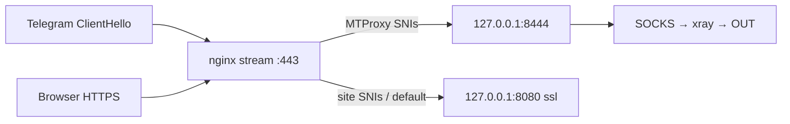

# SNI profile 9+ — architecture and verification

**Profile:** `MTPROXY_MODE=sni` — Telegram on public **`:443`** via host nginx **stream** SNI router.  
**Runbook:** [SNI-CUTOVER.md](./SNI-CUTOVER.md)  
**Related:** [MTPROXY.md](./MTPROXY.md), [PORT-443.md](./PORT-443.md), [CHECK.md](./CHECK.md) phase 11.

---

## Maturity

| Profile | TG port | nginx | Kit score |
|---------|---------|-------|-----------|
| standalone | `:8444` | sites on `:443` http | ~8.5–8.8 |
| **sni (9+)** | `:443` | stream → `:8080` sites + `:8444` MTProxy | ~9.0–9.3 |

With **SNI lint + TLS probes** in `make check 11` → **9.2+** (catches map misroutes before users report).

---

## Traffic flow

---

## Ownership

| Layer | Owner | Verified by |
|-------|-------|-------------|
| Kit `.env` / compose | repo | `verify-mtproxy`, phase 8 |
| teleproxy loopback | repo | phase 11 ports, smoke |
| **nginx stream map** | operator (host) | **`nginx-sni-map`**, **`nginx-sni-tls`** |
| Site vhosts `:8080` | operator | manual `curl` / phase 11 smoke |
| certbot renew | operator | `certbot renew --dry-run` |
| UFW / cloud SG | operator | smoke WARN (UFW); SG manual |

---

## Critical invariant

Every SNI hostname that Telegram may send for the EE proxy must map to **`127.0.0.1:MTPROXY_HOST_PORT`** (default `8444`), not to site backend `:8080`.

**Required host set** (union, deduplicated):

1. `MTPROXY_SNI` in `.data/.env`
2. `MTPROXY_EE_DOMAIN` (e.g. `www.google.com`)
3. Domain decoded from `ee` secret hex tail (e.g. `google.com`)

**Prod incident (2026-09):** map had only `google.com`; clients sent **`www.google.com`** → `default` → site cert → Telegram failed. Fix: add both to map.

---

## Verification layers (kit)

Implementation: `scripts/lib/mtproxy-sni.sh`

| Layer | Function | When | Result |
|-------|----------|------|--------|
| **1. Map lint** | `mtproxy_sni_nginx_lint` | parse `/etc/nginx/stream.d/vpn-bridge-443.conf` | FAIL if required SNI missing or wrong upstream |
| **2. TLS probe** | `mtproxy_sni_tls_probe` | `openssl s_client -connect 127.0.0.1:443 -servername <host>` | FAIL if peer CN is a **site** cert (misroute) |
| **3. Smoke** | `mtproxy_smoke_run` | sni mode: lint + probe after TCP `:8444` | FAIL export / phase 11 |

### Where it runs

| Command | SNI checks |
|---------|------------|
| `make check 11` | `nginx-sni-map`, `nginx-sni-tls` |
| `make verify-mtproxy-smoke` | included in smoke |
| `make verify-sni-443` | lint + probe when `ENABLE_MTPROXY=1` |
| `make regression-443` | smoke + verify-sni |
| `make mtproxy-export` | smoke (unless `SKIP_MTPROXY_SMOKE=1`) |

Override snippet path: `NGINX_STREAM_SNIPPET=/path/to/map.conf`

---

## 9+ readiness checklist

- [ ] `MTPROXY_MODE=sni`, `MTPROXY_SNI` set, `TELEPROXY_VERSION>=4.12.0`
- [ ] teleproxy on `127.0.0.1:8444` only (`ss -tlnp`)
- [ ] nginx `stream {}` + `vpn-bridge-443.conf` installed
- [ ] Site vhosts on `127.0.0.1:8080 ssl` (not public `:443`)
- [ ] Map includes **all** required SNIs (EE + secret tail)
- [ ] `make check 11` — `nginx-sni-map` + `nginx-sni-tls` OK
- [ ] `make mtproxy-export` — link `port=443`
- [ ] TG connect from phone; sites `curl -sI` OK
- [ ] UFW: `443` open, `8444` closed externally
- [ ] `certbot renew --dry-run` scheduled after cutover

---

## Rollback

See [SNI-CUTOVER.md § Rollback](./SNI-CUTOVER.md#rollback).

---

## Backlog (post-9.2)

| Item | Notes |
|------|-------|
| `mtproxy-sync-secret` | secret SSOT from volume |
| TELEPROXY &lt;4.12 FAIL in preflight | wrong link port |
| Cloud SG probe | external `:443` / closed `:8444` |
| certbot DNS-01 reg.ru | when HTTP-01 renew fails |

See [ISSUES.md](../ISSUES.md).

→ [All documentation](./README.md)
