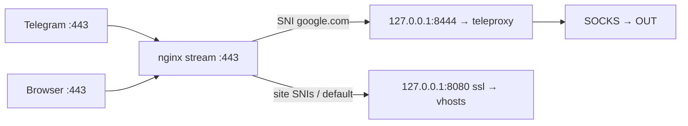

# SNI cutover — single public `:443` (prod 9+)

**Host:** `example-host` (`198.51.100.10`)  
**Last inventory:** 2026-09-04  
**Current profile:** `MTPROXY_MODE=standalone` — TG **`:8444`**, sites on nginx **`:443`** (~8.8)  
**Target profile:** `MTPROXY_MODE=sni` — TG link **`port=443`**, nginx **stream** owns **`:443`** (~9.0–9.3)

Related: [MTPROXY.md](./MTPROXY.md) § SNI, [PORT-443.md](./PORT-443.md), `config/examples/nginx-stream-443.example-host.conf.example`.

---

## Architecture after cutover



| Traffic | SNI / match | Backend |
|---------|-------------|---------|
| Telegram MTProxy | `google.com` | `127.0.0.1:8444` |
| example.com, www | site hostname | `127.0.0.1:8080` ssl |
| example.org, www | site hostname | `127.0.0.1:8080` ssl |
| AWG | UDP `AWG_PORT` | unchanged |
| dev.example.com | `:18443` | **unchanged** (separate vhost) |

---

## Design lock (example-host)

| Decision | Value |
|----------|-------|
| `MTPROXY_MODE` | `sni` |
| `MTPROXY_SNI` | **`google.com`** (EE hex tail in secret — not `www.google.com`) |
| `MTPROXY_EE_DOMAIN` | `www.google.com` (do not change without understanding EE) |
| `MTPROXY_HOST_PORT` | `8444` (loopback backend) |
| `MTPROXY_EXTERNAL_PORT` | `443` (in `tg://` link) |
| `MTPROXY_PUBLISH` | `127.0.0.1` (forced in sni mode) |
| `ENABLE_XRAY_INBOUND` | `0` (no `:8443` in stream map) |
| `TELEPROXY_VERSION` | `4.12.0` (required for correct `port=443` in link) |
| Site backend | `127.0.0.1:8080 ssl` |
| Public ports | **`:443` only** for HTTPS/TG; close **`:8444`** externally |

**Critical:** `MTPROXY_SNI` in the nginx `map` must match what **Telegram sends** in TLS ClientHello for your EE secret. For the pinned secret, that is **`google.com`** (`776f6f676c652e636f6d` in the link tail).

---

## Phase 0 — Inventory (done 2026-09-04)

### Sites

| Domain | Cert | vhost file |
|--------|------|------------|
| `example.com`, `www.example.com` | `/etc/letsencrypt/live/example.com/` | `/etc/nginx/sites-enabled/example.com.conf` |
| `example.org`, `www.example.org` | `/etc/letsencrypt/live/example.org/` | `/etc/nginx/sites-enabled/example.org.conf` |
| `dev.example.com` | separate | `dev.example.com.conf` — **`:18443`**, not in this cutover |

### Ports (before cutover)

```text
:443   nginx http (sites)
:8444  teleproxy 0.0.0.0 (standalone)
:18443 dev.example.com
```

### Kit (`.data/.env`)

```bash
ENABLE_MTPROXY=1
MTPROXY_MODE=standalone
MTPROXY_HOST_PORT=8444
MTPROXY_PUBLISH=0.0.0.0
MTPROXY_EE_DOMAIN=www.google.com
MTPROXY_SECRET=a4b4eb0c0f82833cea42ab9297988200   # pinned
TELEPROXY_VERSION=4.12.0
ENABLE_XRAY_INBOUND=0
```

### Certbot

| Item | Current | After cutover |
|------|---------|---------------|
| Authenticator | **nginx** (HTTP-01) | **DNS-01** (Cloudflare API or manual) |
| Renewal configs | `/etc/letsencrypt/renewal/example.com.conf`, `example.org.conf` | Re-issue with DNS plugin before or during prep |

### nginx

| Item | Status |
|------|--------|
| `with-stream` | yes |
| `/etc/nginx/stream.d/` | **missing** — create before cutover |
| `stream {}` in `nginx.conf` | **missing** — add `include` block |

### Firewall (UFW)

| Rule | Action at cutover |
|------|-------------------|
| `443` | keep |
| `8444/tcp` | **remove** after sni mode verified |
| `18443/tcp` | keep (dev site) |

### Pre-cutover TG backup

```bash
cd ~/amnezia-reality-kit
make mtproxy-export NAME=pre-sni FORCE=1
# → .data/clients_mtproxy/pre-sni.txt (port=8444)
```

---

## Phase 2 — Certbot DNS-01 (before cutover)

After stream owns `:443`, **HTTP-01 via nginx on :443 will not work**.

**Gate:** `sudo certbot renew --dry-run` succeeds for **both** `example.com` and `example.org`.

### Option A — Cloudflare DNS plugin

```bash
# Install once (example)
sudo apt install python3-certbot-dns-cloudflare
# Credentials: /etc/letsencrypt/cloudflare.ini (mode 600)
#   dns_cloudflare_api_token = <token with Zone:DNS:Edit>

sudo certbot certonly \
  --dns-cloudflare \
  --dns-cloudflare-credentials /etc/letsencrypt/cloudflare.ini \
  -d example.com -d www.example.com

sudo certbot certonly \
  --dns-cloudflare \
  --dns-cloudflare-credentials /etc/letsencrypt/cloudflare.ini \
  -d example.org -d www.example.org
```

Update renewal configs so future `certbot renew` uses DNS-01, not nginx.

### Option B — manual DNS-01

```bash
sudo certbot certonly --manual --preferred-challenges dns \
  -d example.com -d www.example.com
# Add TXT _acme-challenge.example.com (and www) per prompt
```

Document TXT records / API token location for the operator.

---

## Phase 3 — Site vhosts → loopback `:8080` (prep)

Edit **only** the TLS `server` blocks in:

- `/etc/nginx/sites-enabled/example.com.conf`
- `/etc/nginx/sites-enabled/example.org.conf`

**Change (both files):**

```nginx
# Before:
    listen 443 ssl http2;
    listen [::]:443 ssl http2;

# After (apply during cutover window — do not reload until stream is ready):
    listen 127.0.0.1:8080 ssl http2;
    # listen [::]:8080 ssl http2;   # optional
```

Keep:

- Port **80** blocks and `/.well-known/acme-challenge/` until DNS-01 is live (then port 80 is optional).
- Same `ssl_certificate` paths and all `location` blocks.

**Do not reload** with only `8080` until stream listens on `443` — otherwise sites go down.

**Prep check (draft):**

```bash
# Optional: validate syntax with a commented duplicate file, then:
sudo nginx -t
```

---

## Phase 4 — nginx stream SNI router

### 4.1 Enable stream in main config

`/etc/nginx/nginx.conf` currently has **no** `stream {}` block. Append **after** the `http {}` block:

```nginx
stream {
    include /etc/nginx/stream.d/*.conf;
}
```

```bash
sudo mkdir -p /etc/nginx/stream.d
```

### 4.2 Install map (example-host)

```bash
cd ~/amnezia-reality-kit
sudo cp config/examples/nginx-stream-443.example-host.conf.example \
     /etc/nginx/stream.d/vpn-bridge-443.conf
```

Or generic template: `config/examples/nginx-stream-443.conf.example`.

**Do not reload yet** if site vhosts still listen on `443` — nginx cannot bind `:443` twice.

---

## Phase 5 — Cutover (maintenance window, ~30–60 min)

Order matters. Schedule **1–2 h** off-peak; rollback **15–30 min**.

### 5.1 Kit → `sni` (teleproxy on loopback)

Edit `.data/.env`:

```bash
ENABLE_MTPROXY=1
MTPROXY_MODE=sni
MTPROXY_SNI=google.com
MTPROXY_EE_DOMAIN=www.google.com
MTPROXY_HOST_PORT=8444
ENABLE_XRAY_INBOUND=0
TELEPROXY_VERSION=4.12.0
# MTPROXY_SECRET=...  — keep pinned value
```

```bash
cd ~/amnezia-reality-kit
make build && make images-pull-upstream && make refresh-full
```

**Gate:**

```bash
ss -tlnp | grep 8444
# expect 127.0.0.1:8444 — NOT 0.0.0.0:8444
```

### 5.2 nginx cutover (atomic)

In one session:

1. Change site vhosts: `listen 443` → `listen 127.0.0.1:8080 ssl` (phase 3).
2. Ensure `/etc/nginx/stream.d/vpn-bridge-443.conf` and `stream {}` include exist.
3. Reload:

```bash
sudo nginx -t && sudo systemctl reload nginx
```

**Gate immediately after reload:**

```bash
ss -tlnp | grep ':443'
# nginx (stream) on 0.0.0.0:443

curl -sI https://example.com/ | head -3
curl -sI https://example.org/ | head -3

openssl s_client -connect 127.0.0.1:443 -servername google.com -brief </dev/null 2>&1 | head -8
# Must NOT present example.com / example.org certificate

curl -s http://127.0.0.1:8888/stats | head -5
```

### 5.3 Firewall

```bash
sudo ufw delete allow 8444/tcp
# Cloud SG: close 8444/tcp as well
```

### 5.4 New Telegram link

```bash
make mtproxy-export NAME=main FORCE=1
# port=443 required
```

Distribute **new** link to users. Old `:8444` link stops working after firewall close.

---

## Phase 6 — Regression gate (kit)

```bash
make verify-mtproxy
make verify-sni-443
make regression-443
make check 11
# or full: make check
```

| # | Check | Pass |
|---|-------|------|
| 1 | AWG + web exit via OUT | traffic exits OUT |
| 2 | `https://example.com/` | 200/301 |
| 3 | `https://example.org/` | 200/301 |
| 4 | TG proxy `port=443` | connect + messages |
| 5 | `docker ps` | 4 containers healthy |
| 6 | `ss -tlnp \| grep 8444` | only `127.0.0.1` |

---

## Phase 7 — Monitor 24–48 h

```bash
docker logs vpn-teleproxy --since 1h
curl -s http://127.0.0.1:8888/stats
make check 11
sudo certbot certificates
```

---

## Rollback

If sites or TG break:

```bash
# 1. nginx — remove stream, restore site listen 443
sudo rm /etc/nginx/stream.d/vpn-bridge-443.conf
# Revert example.com.conf + example.org.conf: listen 443 ssl http2
sudo nginx -t && sudo systemctl reload nginx

# 2. kit → standalone
# .data/.env:
MTPROXY_MODE=standalone
MTPROXY_PUBLISH=0.0.0.0
MTPROXY_HOST_PORT=8444
MTPROXY_SNI=

cd ~/amnezia-reality-kit
make build && make refresh-full

# 3. firewall
sudo ufw allow 8444/tcp comment 'MTProxy standalone'

# 4. old link from pre-sni export
cat .data/clients_mtproxy/pre-sni.txt
```

AWG stack is untouched.

---

## Ready-for-cutover checklist

- [ ] DNS-01 certbot dry-run OK for `example.com` and `example.org`
- [ ] `MTPROXY_SECRET` pinned in `.data/.env`
- [ ] `MTPROXY_SNI=google.com` agreed with EE secret
- [ ] `make mtproxy-export NAME=pre-sni` backup saved
- [ ] `stream {}` + `vpn-bridge-443.conf` written; `nginx -t` OK **in maintenance** (both changes together)
- [ ] Maintenance window scheduled
- [ ] Rollback steps reviewed
- [ ] Users notified: new TG link after cutover

---

## Time / risk estimate

| Phase | Time | Risk |
|-------|------|------|
| 0–1 Design | 30 min | low |
| 2 Certbot DNS-01 | 1–3 h (DNS dependent) | medium |
| 3–4 nginx prep | 1 h | medium |
| 5 Cutover | 30–60 min | **high** (sites) |
| 6–7 Verify | 30 min + 48 h watch | low |

**Highest risk:** simultaneous move of vhosts to `8080` and enabling stream on `:443`. Complete **DNS-01 before** cutover.

---

## Post-cutover kit backlog (optional)

| Task | Purpose |
|------|---------|
| Preflight WARN: standalone + 8444 not in UFW | catch misconfig |
| Preflight FAIL: Teleproxy &lt; 4.12 + host≠container port | bad `port=` in link |
| `make mtproxy-sync-secret` | secret SSOT from volume |
| Lint nginx map vs `MTPROXY_SNI` / EE / secret | **done** — `make check 11` (`nginx-sni-map`, `nginx-sni-tls`); see [SNI-9-PLUS.md](./SNI-9-PLUS.md) |
| Remove deprecated `mtproxy-link*` Makefile aliases | cleanup |

See [ISSUES.md](../ISSUES.md).

→ [All documentation](./README.md)
